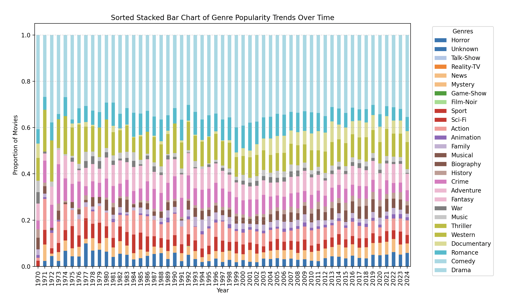
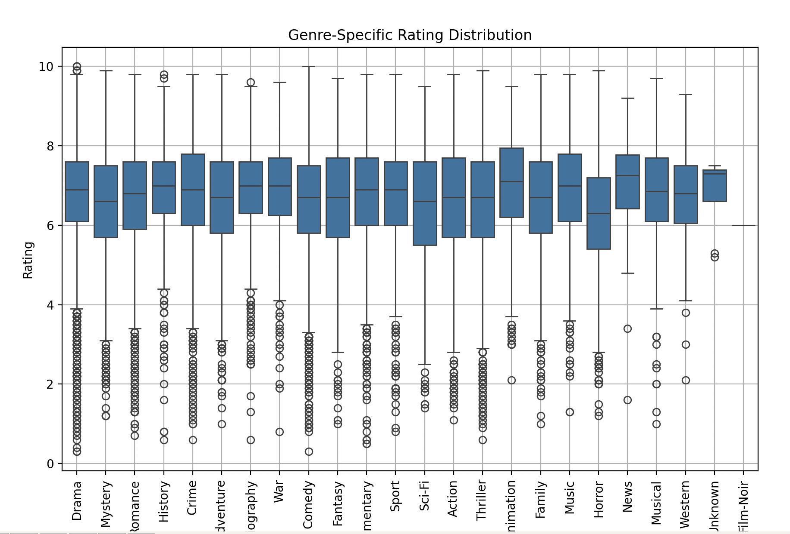

## Explore Genre Trend of Movies and Genre-Specific Rating Distribution in the Past 100 Years

## Dataset
This dataset contains detailed information on over 16,000 movies released between 1910 and 2024, along with their corresponding Metacritic ratings. The dataset is an extensive collection for film enthusiasts, researchers, and data scientists interested in exploring trends in cinema over more than a century.
https://www.kaggle.com/datasets/kashifsahil/16000-movies-1910-2024-metacritic?resource=download 

## Techniques Applied
Pandas and Polars, and also Jupyter to walkthrough the two version for benchmark.

## Data Visualization
For the visualization, I used a sorted stacked bar chart and boxplot. 

## Summary Statistics
People love Drama most, over 100 years! 
[View the Document](main.pdf)

# Project File Structure

- ./
    - main.ipynb
    - main.pdf
    - requirements.txt
    - Dockerfile
    - Makefile
    - README.md
    - structure.py
    - movies.csv
    - analysis/
        - pandas_analysis.py
        - benchmark.py
        - polars_analysis.py
    - __pycache__/
        - pandas.cpython-312.pyc
        - mov_polars.cpython-312.pyc
        - movies_ana_polars.cpython-312.pyc

1. Things included are:

* `Jupyter`  `main.ipynb`  

* `Python Script`  `analysis` 

* `pandas` `polars` `benchmark.py` 

* `Makefile`  

* `requirements.txt`

* `Gitlab/Github Actions` `CI`

